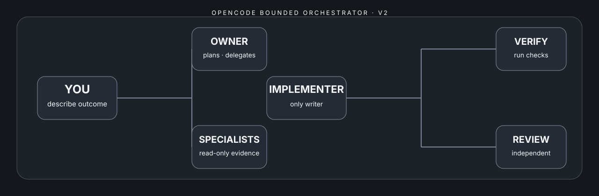
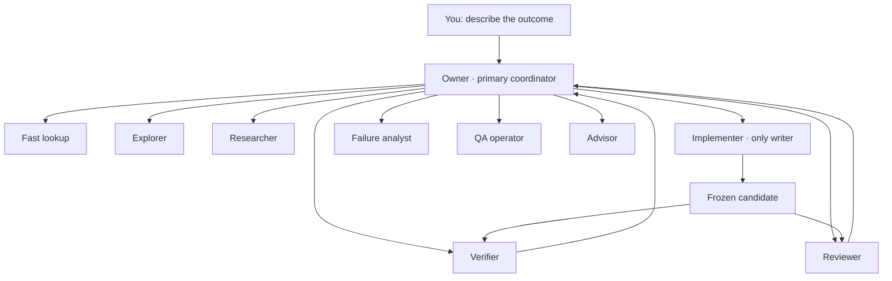

[English](README.md) · [Türkçe](README.tr.md)



# OpenCode Bounded Orchestrator

[](https://github.com/metapak/opencode-bounded-orchestrator/actions/workflows/ci.yml)
[](LICENSE)

A provider-neutral operating layer for **OpenCode V2** that plans, delegates, implements, verifies, measures, and safely resumes material repository work.

You keep writing normal requests such as “fix this bug” or “add this feature.” A primary owner turns the request into bounded tasks, assigns one writer, verifies an exact candidate, records interrupted work, and closes only when required checks are complete.

> Unofficial community project. It is not affiliated with or endorsed by OpenCode or its maintainers.

## Why use it?

- **One writer per scope:** only `implementer` may edit.
- **One delegation level:** the owner can call a fixed specialist allowlist; every child denies subagents.
- **Provider neutral by default:** all roles inherit the model selected in the current OpenCode session.
- **Finite work:** every role has a positive `steps` budget and repair loops stop after bounded attempts.
- **Exact review candidate:** changes after a freeze make the candidate stale.
- **Recoverable task history:** interrupted, waiting, repair, retry, and attempt states stay in ignored local metadata.
- **Truthful usage reporting:** wraps `opencode stats --json`; missing data is reported as unavailable.
- **Optional local evaluation:** runs one explicit argv list without a shell and binds the result to the candidate.

## Architecture



OpenCode V2 does not document a numeric subagent-depth option. This configuration creates the same practical boundary with an owner allowlist and a child-level `subagent: deny` rule.

## Quick start

Requirements: Git, Python 3.10+, and **OpenCode V2 2.0.0 or later**. The repository targets the documented V2 configuration shape; available providers, models, and variants still depend on your OpenCode installation and accounts.

### macOS

1. Download and fully extract the macOS/Linux ZIP.
2. Double-click `setup.command`.
3. Drag the target Git repository into Terminal.
4. Choose **Balanced** unless you have a specific reason to change it.
5. Restart OpenCode in that repository.

### Linux

```bash
python3 scripts/install.py --target /path/to/repository --action install --profile balanced
```

### Windows

1. Download and fully extract the Windows ZIP.
2. Double-click `setup.cmd`.
3. Paste the target repository path and follow the prompts.

See [macOS/Linux installation](INSTALL-MACOS-LINUX.md) and [Windows installation](INSTALL-WINDOWS.md).

## Profiles

| Profile | Behavior |
|---|---|
| Balanced | Recommended finite step budgets for everyday work. |
| Quality | Larger step budgets for demanding work. |
| Economy | Smaller budgets for routine work. |
| Quota saver | The smallest bundled budgets; may stop earlier on complex work. |
| Custom | Optional exact `provider/model[#variant]` selector plus role overrides. |

Bundled profiles change **step budgets only**. They do not claim to change reasoning effort or guarantee lower token use. Default installation writes no provider, model, variant, or API key. Configure provider access through OpenCode `/connect` and select models through `/models`.

Custom selectors must use `provider/model` or `provider/model#variant`. Native roles must stay on one provider unless the user explicitly confirms mixed providers or passes `--allow-mixed-providers`. A role-only override cannot be compared with an unknown inherited session provider, so it requires either an explicit default `--model` or the same mixed-provider gate. Model availability is not pre-validated by this package.

See [profiles](docs/profiles.md).

## Included local tools

```bash
python3 .opencode/tools/ledger.py --help
python3 .opencode/tools/candidate.py --help
python3 .opencode/tools/usage_report.py --json
python3 .opencode/tools/local_eval.py --help
```

The tools record hashes and short metadata. They do not store prompts, transcripts, source text, or credentials. Runtime state lives under `.opencode/.bounded-orchestrator/` and `.opencode/.candidate/`, both ignored by Git.

Read [usage and local evaluation](docs/usage-and-local-eval.md), [task ledger](docs/task-ledger.md), [architecture](docs/architecture.md), [examples](docs/examples.md), and [FAQ](docs/faq.md).

## Safe installation and removal

The installer owns files through a checksum manifest. It backs up conflicts only when replacement is chosen, updates the managed `AGENTS.md` block, and preserves unrelated or user-modified files during uninstall. The two harmless runtime `.gitignore` sentinels always remain so retained backups, ledger runs, evaluations, and candidate state do not appear in Git status after uninstall. Use `--action dry-run` to preview changes.

## Supported platforms

Installer and repository tests run on Ubuntu, macOS, and Windows in GitHub Actions. CI also live-loads the configuration with `@opencode/cli@2.0.3` and checks the effective bounded permissions. Actual provider/model responses remain outside this repository’s test boundary.

## Roadmap and community

See the [roadmap](docs/roadmap.md), [contribution guide](CONTRIBUTING.md), [security policy](SECURITY.md), [changelog](CHANGELOG.md), and [v0.1.0 release notes](docs/release-v0.1.0.md).

Apache-2.0 licensed. Attribution and provenance are in [NOTICE](NOTICE) and [provenance](docs/provenance.md).
