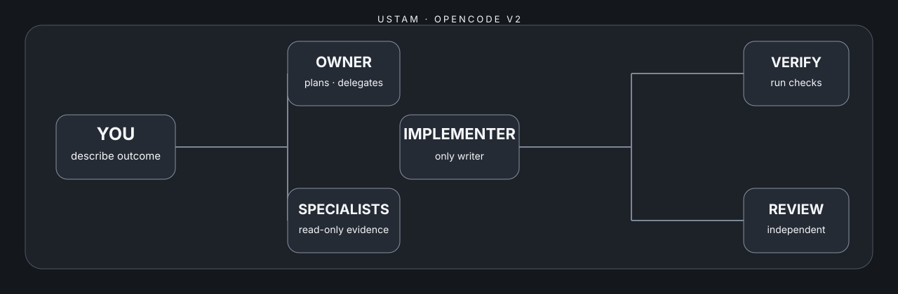

[English](README.md) · [Türkçe](README.tr.md)

# OpenCode Bounded Orchestrator

A local, bilingual setup and usage console for a bounded **OpenCode V2** team. You describe the outcome; a primary conductor plans and delegates scoped work to helpers. The conductor does not research, edit, build, test, or review source itself.

> Unofficial community project; not affiliated with or endorsed by OpenCode or its maintainers.

## Start in the browser

Fully extract the appropriate ZIP, then:

- **macOS:** open `launchers/Bounded Orchestrator.app` and choose an existing project folder.
- **Windows:** open `launchers/Launch Bounded Orchestrator.vbs` and choose an existing project folder.
- **Linux or terminal:** run `python3 scripts/dashboard.py /path/to/project` from the extracted package.

The launcher needs **Python 3.11+** installed separately; it does not bundle Python. The project folder need not be a Git repository, though Git is useful for repository work. OpenCode V2 2.0.0+ is needed to use the installed agents. The browser console is local to `127.0.0.1`, opens in Turkish by default, and can switch to English. The selected project path is read-only in the page. To work on another project, reopen the launcher and choose that folder.

In **Setup**, choose 1–10 available helper slots, a duty and model for each, and a working style. Two slots may have the same duty; they remain distinct named OpenCode agents. Review the file changes before **Install and save**, then restart OpenCode in that project. The slot count is capacity, not an automatic launch count or a guaranteed numeric concurrency limit. Available models depend on your OpenCode installation and provider access. If a verified variant/effort list is unavailable, new variant choices are disabled; an existing custom selector remains preserved.

The older guided `setup.command` / `setup.cmd` and `scripts/install.py` terminal installers remain available. See [macOS/Linux installation](INSTALL-MACOS-LINUX.md), [Windows installation](INSTALL-WINDOWS.md), and [local console details](docs/local-console.md).

## How the team works

The installed primary `owner` has a deny-by-default tool policy with only its bounded-orchestrator skill, user questions, and the selected helper subagents allowed. Its instructions limit it to conversation, planning, delegation, and concise worker reports. Helper agents deny further subagent delegation; only an `implementer`-based helper writes implementation in an assigned scope. The default team uses one suitable helper; parallel work needs independent scopes and a reason. These are OpenCode configuration and instructions, not a claim that this package controls every external runtime behavior.

The browser shows a *planned* team in Setup and *observed* sessions in Usage. They are different: four characters in a sample orchestra do not mean a four-agent limit or four currently running agents. Usage can show a conductor and linked child-session helpers when OpenCode's sanitized exports provide stable session relationships. Each observed character has its own duty illustration and visible model/variant information; missing values are marked unavailable, and model or role alone never becomes an agent identity. Select the conductor to play the baton and notes; it loops until you click elsewhere. Enter and Space also activate the button. There is no automatic animation or separate Animate control.

Usage charts use exact counters from up to 12 recent sanitized session exports, with unknown and partial coverage shown explicitly. `opencode stats` is display data and may be rounded; it is not silently merged into exact charts. A working style breakdown is an estimate only when a session can be matched conservatively to local settings history. No cost, quota, savings, subscription balance, or live-agent activity is inferred. DEMO fixtures are labeled as examples, not account usage. See [usage and local evaluation](docs/usage-and-local-eval.md).

## Preferences and safe changes

Working styles set finite OpenCode `steps` budgets, not token ceilings. Economy and Quota saver allow fewer steps and can stop earlier; Quality allows more steps. They do not promise token savings or alter reasoning effort automatically. The model picker uses the selected project's `opencode models` list when available; offline examples are visibly unverified. **Refresh model list** asks OpenCode to refresh only when clicked. No credentials or chat bodies are shown in the console.

Setup changes are previewed, then written to the chosen project with an ownership manifest and private backups. Reducing a roster removes only previously owned, unchanged helper files; removed files are backed up. **Preferences → Undo last change** reverses only the last console-managed preference save while preserving unrelated settings. It does not undo a roster install or reduction. Modified or conflicting managed files require a safe resolution rather than silent overwrite. Private runtime state stays ignored by Git; uninstall preserves unrelated and changed files. See [profiles](docs/profiles.md), [architecture](docs/architecture.md), [task ledger](docs/task-ledger.md), and [FAQ](docs/faq.md).

## Development and limits

Installer and repository tests run in GitHub Actions on Ubuntu, macOS, and Windows. This development environment did not have the OpenCode CLI or a real provider session, and native Finder/Windows double-click behavior was not exercised here. Browser flows were checked with sanitized fixtures; model access, variants, and live export shapes still depend on your installation. The documented OpenCode V2 config and permission contracts underpin the generated files, but the package cannot guarantee model availability or a numeric worker concurrency cap.

See the [roadmap](docs/roadmap.md), [contribution guide](CONTRIBUTING.md), [security policy](SECURITY.md), [changelog](CHANGELOG.md), and [release notes](docs/release-v0.1.0.md). Apache-2.0 licensed; attribution is in [NOTICE](NOTICE) and [provenance](docs/provenance.md).
