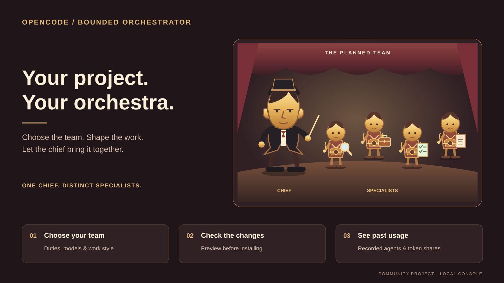
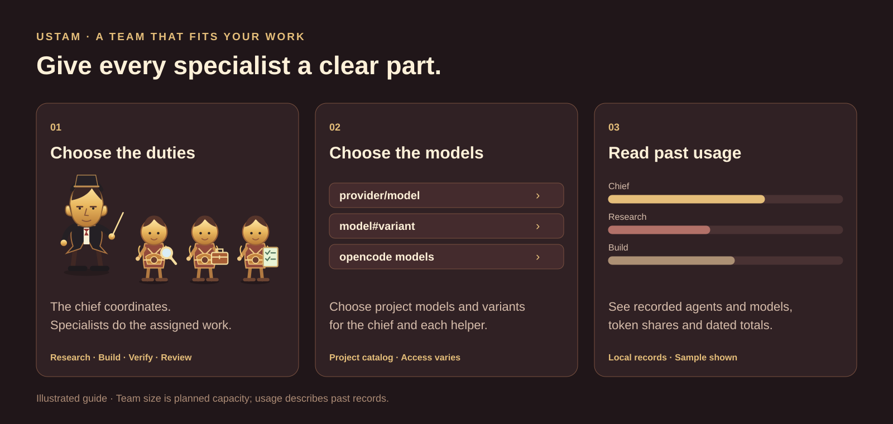
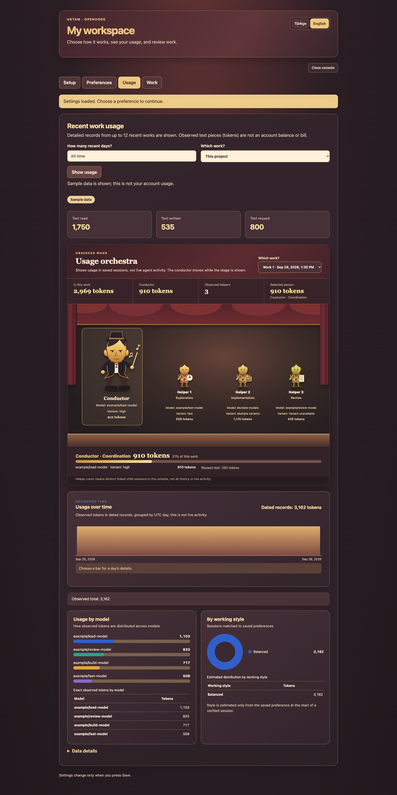
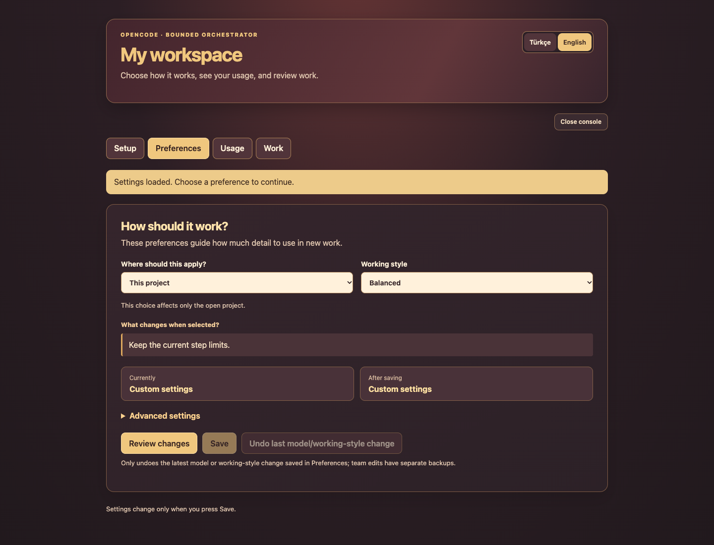

[English](README.md) · [Türkçe](README.tr.md)



# Ustam

<!-- ustam-hub-quickstart:start -->
## Start with Ustam 1.0.0-beta.2

The same local application for Codex, Claude Code, and OpenCode.

1. **Download:** Open the [beta release](https://github.com/metapak/ustam-opencode-orchestrator/releases/tag/ustam-v1.0.0-beta.2) and extract the native ZIP for your system completely: [Mac Apple silicon](https://github.com/metapak/ustam-opencode-orchestrator/releases/download/ustam-v1.0.0-beta.2/ustam-1.0.0-beta.2-macos-arm64.zip) · [Mac Intel](https://github.com/metapak/ustam-opencode-orchestrator/releases/download/ustam-v1.0.0-beta.2/ustam-1.0.0-beta.2-macos-x86_64.zip) · [Windows](https://github.com/metapak/ustam-opencode-orchestrator/releases/download/ustam-v1.0.0-beta.2/ustam-1.0.0-beta.2-windows-x86_64.zip) · [Linux](https://github.com/metapak/ustam-opencode-orchestrator/releases/download/ustam-v1.0.0-beta.2/ustam-1.0.0-beta.2-linux-x86_64.zip).
2. **Open:** Open **Ustam.app** on Mac, **Ustam.exe** on Windows, or **Ustam** on Linux. The Mac app contains its runtime and can be moved on its own; keep the extracted Windows/Linux files together. No external Python is required.
3. **Select apps:** Choose Codex, Claude Code, or OpenCode. Install and sign in to each selected provider's CLI.
4. **Add projects:** Add folders inside the local browser page, choose an orchestra, check changes, and apply them.

This beta is unsigned and not notarized. Mac Gatekeeper may block the download. Provider accounts and model access are separate requirements. [Local hub guide](docs/ustam-hub.md).
<!-- ustam-hub-quickstart:end -->

Mac beta.1 showed a “damaged” warning because of a packaging signature error. Replace only the app with beta.2; project and provider settings do not need reinstalling.

## Advanced Opencode source console compatibility

The provider-specific console and source installation steps below remain available. Their Python requirement applies to this source path.

[](https://github.com/metapak/ustam-opencode-orchestrator/actions/workflows/ci.yml)
[](LICENSE)

A local, bilingual setup and usage console for a bounded **OpenCode V2** team. You describe the outcome; a primary conductor plans and delegates scoped work to helpers. The conductor does not research, edit, build, test, or review source itself.

> Unofficial community project; not affiliated with or endorsed by OpenCode or its maintainers.

## Install in four steps

Have OpenCode V2 2.0.0+ and [Python 3.11 or newer](https://www.python.org/downloads/) installed first. Python is **not included** in this download.

1. **Download:** [Get the current ZIP](https://github.com/metapak/ustam-opencode-orchestrator/archive/refs/heads/main.zip) and open the extracted folder.
2. **Open:** On Mac, open `launchers` and double-click **Ustam.app**. On Windows, double-click **Launch Ustam.vbs** in the same folder. On Linux, use the short command below.
3. **Choose a project:** On Mac or Windows, pick the folder where you use OpenCode. On Linux, the command includes that folder instead.
4. **Install:** In the browser, keep the suggested team or change it. Click **Review setup**, check the file list, then **Install and save**. Restart OpenCode in that project.

Keep the Mac app inside the extracted folder. If macOS asks for the setup package, its first dialog explains which folder to choose: the outer folder extracted from the ZIP whose name starts with `ustam-opencode-orchestrator`. The short picker opens in Downloads; the folder contains `launchers` and `scripts`. Choose **Try again** after a wrong selection. The second dialog asks for the separate Git project where you use OpenCode; settings go there before setup continues in the browser. Dialogs use Turkish or English based on your primary system language. If the browser cannot open, the launcher shows the full local address to open manually.

<details>
<summary>Linux: open the same setup page</summary>

Linux has no double-click launcher or folder picker in this package. Open a terminal in the extracted folder, then run this with your project's path:

```bash
python3 scripts/dashboard.py /absolute/path/to/your-project
```

</details>

To change the team later, open the launcher again (or repeat the Linux command) and **Save** the new choices. It updates the project settings without uninstalling. An already-open OpenCode session may need to be reopened before it uses the changes. If setup does not open, see the [Mac/Linux](INSTALL-MACOS-LINUX.md) or [Windows](INSTALL-WINDOWS.md) guide.

## How the team works



The installed primary `owner` has a deny-by-default tool policy with only its bounded-orchestrator skill, user questions, and the selected helper subagents allowed. Its instructions limit it to conversation, planning, delegation, and concise worker reports. Helper agents deny further subagent delegation; only an `implementer`-based helper writes implementation in an assigned scope. The default team uses one suitable helper; parallel work needs independent scopes and a reason. These are OpenCode configuration and instructions, not a claim that this package controls every external runtime behavior.

The browser shows a *planned* team in Setup and *observed* sessions in Usage. They are different: four characters in a sample orchestra do not mean a four-agent limit or four currently running agents. Usage can show a conductor and linked child-session helpers when OpenCode's sanitized exports provide stable session relationships. Each observed character has its own duty illustration and visible model/variant information; missing values are marked unavailable, and model or role alone never becomes an agent identity. Select the conductor to play the baton and notes; it loops until you click elsewhere. Enter and Space also activate the button. There is no automatic animation or separate Animate control.

Usage charts use exact counters from up to 12 recent sanitized session exports, with unknown and partial coverage shown explicitly. `opencode stats` is display data and may be rounded; it is not silently merged into exact charts. A working style breakdown is an estimate only when a session can be matched conservatively to local settings history. No cost, quota, savings, subscription balance, or live-agent activity is inferred. DEMO fixtures are labeled as examples, not account usage. See [usage and local evaluation](docs/usage-and-local-eval.md).

## See recorded usage



*Captured from the current local console using sanitized demo fixtures. Sessions, models, variants and token counts are examples; this is recorded usage, not live activity.*

## Preferences and safe changes



*Current local interface in a temporary demo project. Model access depends on the project and configured provider.*

Working styles set finite OpenCode `steps` budgets, not token ceilings. Economy and Quota saver allow fewer steps and can stop earlier; Quality allows more steps. They do not promise token savings or alter reasoning effort automatically. The model picker uses the selected project's `opencode models` list when available; offline examples are visibly unverified. **Refresh model list** asks OpenCode to refresh only when clicked. No credentials or chat bodies are shown in the console.

Setup changes are previewed, then written to the chosen project with an ownership manifest and private backups. Reducing a roster removes only previously owned, unchanged helper files; removed files are backed up. **Preferences → Undo last change** reverses only the last console-managed preference save while preserving unrelated settings. It does not undo a roster install or reduction. Modified or conflicting managed files require a safe resolution rather than silent overwrite. Private runtime state stays ignored by Git; uninstall preserves unrelated and changed files. See [profiles](docs/profiles.md), [architecture](docs/architecture.md), [task ledger](docs/task-ledger.md), and [FAQ](docs/faq.md).

## Ustam introduction

[](https://raw.githubusercontent.com/metapak/ustam-opencode-orchestrator/main/docs/assets/ustam-promo-en-40s.mp4)

A 40-second English introduction to Ustam. The illustrated preview uses sample data. [Watch or download the MP4](https://raw.githubusercontent.com/metapak/ustam-opencode-orchestrator/main/docs/assets/ustam-promo-en-40s.mp4).

## Development and limits

Installer and repository tests run in GitHub Actions on Ubuntu, macOS, and Windows. This development environment did not have the OpenCode CLI or a real provider session, and native Finder/Windows double-click behavior was not exercised here. Browser flows were checked with sanitized fixtures; model access, variants, and live export shapes still depend on your installation. The documented OpenCode V2 config and permission contracts underpin the generated files, but the package cannot guarantee model availability or a numeric worker concurrency cap.

See the [roadmap](docs/roadmap.md), [contribution guide](CONTRIBUTING.md), [security policy](SECURITY.md), [changelog](CHANGELOG.md), and [release notes](docs/release-v0.1.0.md). Apache-2.0 licensed; attribution is in [NOTICE](NOTICE) and [provenance](docs/provenance.md).
