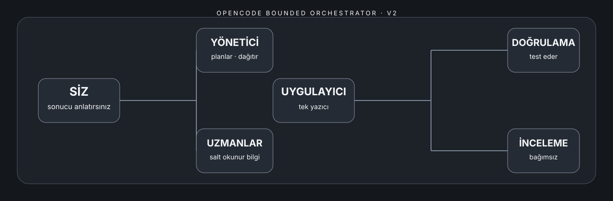
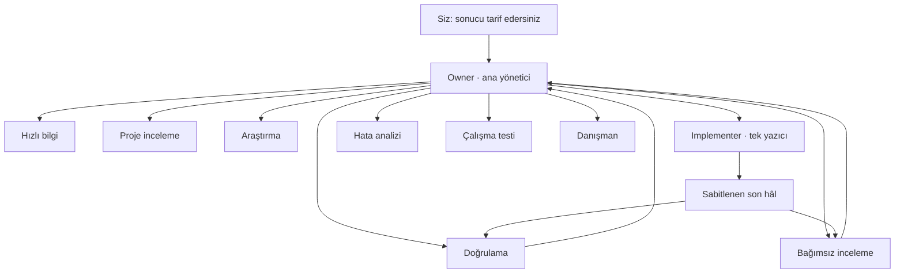

[English](README.md) · [Türkçe](README.tr.md)



# OpenCode Bounded Orchestrator

[](https://github.com/metapak/opencode-bounded-orchestrator/actions/workflows/ci.yml)
[](LICENSE)

**OpenCode V2** için işi planlayan, rollere ayıran, uygulayan, doğrulayan, ölçen ve yarım kalan çalışmaya güvenli biçimde devam eden sağlayıcı bağımsız bir çalışma düzeni.

Siz “bu hatayı düzelt” veya “şu özelliği ekle” diye normal şekilde yazarsınız. Ana yönetici isteği sınırları belli görevlere böler, tek bir uygulayıcıya yazma yetkisi verir, son dosyaları sabitler, yarım kalan işleri kaydeder ve zorunlu kontroller tamamlanmadan işi kapatmaz.

> Resmî olmayan bir topluluk projesidir. OpenCode veya geliştiricileri tarafından desteklendiği anlamına gelmez.

## Neden kullanılır?

- **Her alanda tek yazıcı:** yalnızca `implementer` dosya değiştirebilir.
- **Tek delegasyon seviyesi:** ana yönetici yalnızca izin verilen uzmanları çağırabilir; alt roller başka yardımcı çağıramaz.
- **Varsayılan olarak sağlayıcı bağımsız:** bütün roller mevcut OpenCode oturumunda seçilen modeli devralır.
- **Sınırlı çalışma:** her rolün belirli bir adım bütçesi vardır; düzeltme döngüleri sonsuza uzamaz.
- **Sabitlenen son hâl:** sabitlemeden sonra değişen dosyalar eski kontrolü geçersiz kılar.
- **Devam edilebilir görev kaydı:** yarım kalan, yanıt bekleyen, onarım ve tekrar durumları yerel olarak tutulur.
- **Gerçeğe bağlı kullanım raporu:** `opencode stats --json` sonucunu gösterir; veri yoksa tahmin üretmez.
- **İsteğe bağlı yerel son kontrol:** açıkça seçilen komutu kabuk kullanmadan çalıştırır ve sonucu dosyaların o hâline bağlar.

## Mimari



OpenCode V2 belgelerinde sayısal bir alt yardımcı derinliği ayarı bulunmuyor. Paket, ana yönetici için sabit izin listesi ve her alt rolde `subagent: deny` kullanarak aynı pratik sınırı oluşturur.

## Hızlı Kurulum

Gerekenler: Git, Python 3.10+ ve **OpenCode V2 2.0.0 veya üzeri**. Paket belgelenen V2 ayar yapısını hedefler. Kullanılabilen sağlayıcı, model ve varyantlar OpenCode kurulumunuza ve hesaplarınıza bağlıdır.

### macOS

1. macOS/Linux ZIP dosyasını indirin ve tamamen çıkarın.
2. `setup.command` dosyasına çift tıklayın.
3. Hedef Git proje klasörünü Terminal’e sürükleyin.
4. Özel bir ihtiyacınız yoksa **Dengeli** profilini seçin.
5. OpenCode’u bu proje içinde yeniden başlatın.

### Linux

```bash
python3 scripts/install.py --target /proje/yolu --action install --profile balanced
```

### Windows

1. Windows ZIP dosyasını indirin ve tamamen çıkarın.
2. `setup.cmd` dosyasına çift tıklayın.
3. Hedef proje yolunu yapıştırıp adımları izleyin.

Ayrıntılar: [macOS/Linux kurulumu](INSTALL-MACOS-LINUX.md) ve [Windows kurulumu](INSTALL-WINDOWS.md).

## Profiller

| Profil | Davranış |
|---|---|
| Dengeli | Günlük işler için önerilen sınırlı adım bütçeleri. |
| Yüksek Kalite | Zor işler için daha geniş adım bütçeleri. |
| Ekonomik | Rutin işler için daha küçük bütçeler. |
| Kota Tasarrufu | En küçük hazır bütçeler; zor işlerde daha erken durabilir. |
| Özel | İsteğe bağlı `sağlayıcı/model[#varyant]` seçimi ve rol bazlı seçimler. |

Hazır profiller yalnızca **adım bütçelerini** değiştirir. Düşünme seviyesini değiştirdiği veya kesin olarak daha az token harcadığı iddia edilmez. Varsayılan kurulum sağlayıcı, model, varyant ya da API anahtarı yazmaz. Sağlayıcı bağlantısını OpenCode içinde `/connect`, model seçimini `/models` ile yapın.

Özel seçimler `sağlayıcı/model` veya `sağlayıcı/model#varyant` biçiminde olmalıdır. Kullanıcı açıkça onaylamadıkça bütün yerel roller aynı sağlayıcıyı kullanır. Paket modelin hesabınızda bulunup bulunmadığını önceden doğrulamaz.

Bkz. [profiller](docs/profiles.tr.md).

## Yerel Araçlar

```bash
python3 .opencode/tools/ledger.py --help
python3 .opencode/tools/candidate.py --help
python3 .opencode/tools/usage_report.py --json
python3 .opencode/tools/local_eval.py --help
```

Araçlar yalnızca kısa bilgiler ve dosya parmak izleri kaydeder. İstemleri, konuşma geçmişini, kaynak kod metnini veya kimlik bilgilerini saklamaz. Çalışma verileri `.opencode/.bounded-orchestrator/` ve `.opencode/.candidate/` altında tutulur ve Git tarafından yok sayılır.

[Kullanım ve yerel kontrol](docs/usage-and-local-eval.tr.md), [görev kaydı](docs/task-ledger.tr.md), [mimari](docs/architecture.md), [örnekler](docs/examples.tr.md) ve [SSS](docs/faq.tr.md) bölümlerine bakabilirsiniz.

## Güvenli Kurulum ve Kaldırma

Kurucu, yönettiği dosyaları sağlama toplamlarıyla takip eder. Kullanıcı isterse çakışan dosyaları yedekleyip değiştirir, `AGENTS.md` içindeki kendi bölümünü günceller ve kaldırma sırasında değiştirilmiş veya ilgisiz dosyaları korur. Ön izleme için `--action dry-run` kullanılabilir.

## Desteklenen Platformlar

Kurucu ve depo kontrolleri GitHub Actions üzerinde Ubuntu, macOS ve Windows’ta çalıştırılır. CI ayrıca ayarları `@opencode/cli@2.0.3` ile gerçekten yükler ve etkili rol izinlerini kontrol eder. Sağlayıcıların ve modellerin verdiği gerçek yanıtlar bu testlerin kapsamı dışındadır.

## Yol Haritası ve Katkı

[Yol haritası](docs/roadmap.tr.md), [katkı rehberi](CONTRIBUTING.md), [güvenlik politikası](SECURITY.md), [değişiklik geçmişi](CHANGELOG.md) ve [v0.1.0 sürüm notlarına](docs/release-v0.1.0.tr.md) bakabilirsiniz.

Apache-2.0 lisanslıdır. Atıf ve kaynak bilgileri [NOTICE](NOTICE) ile [provenance](docs/provenance.md) dosyalarındadır.
