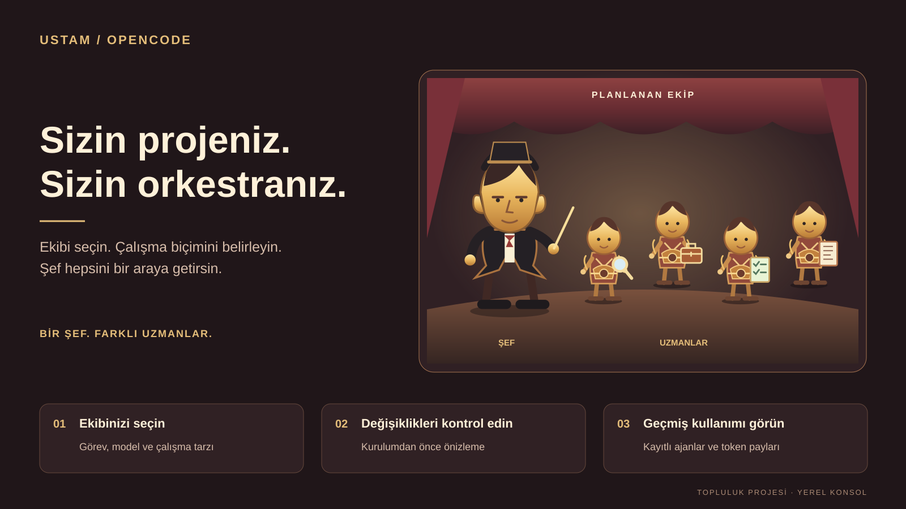
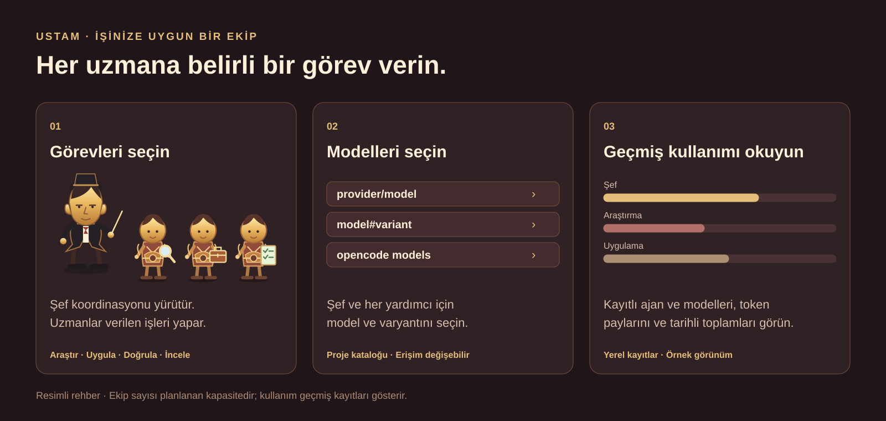
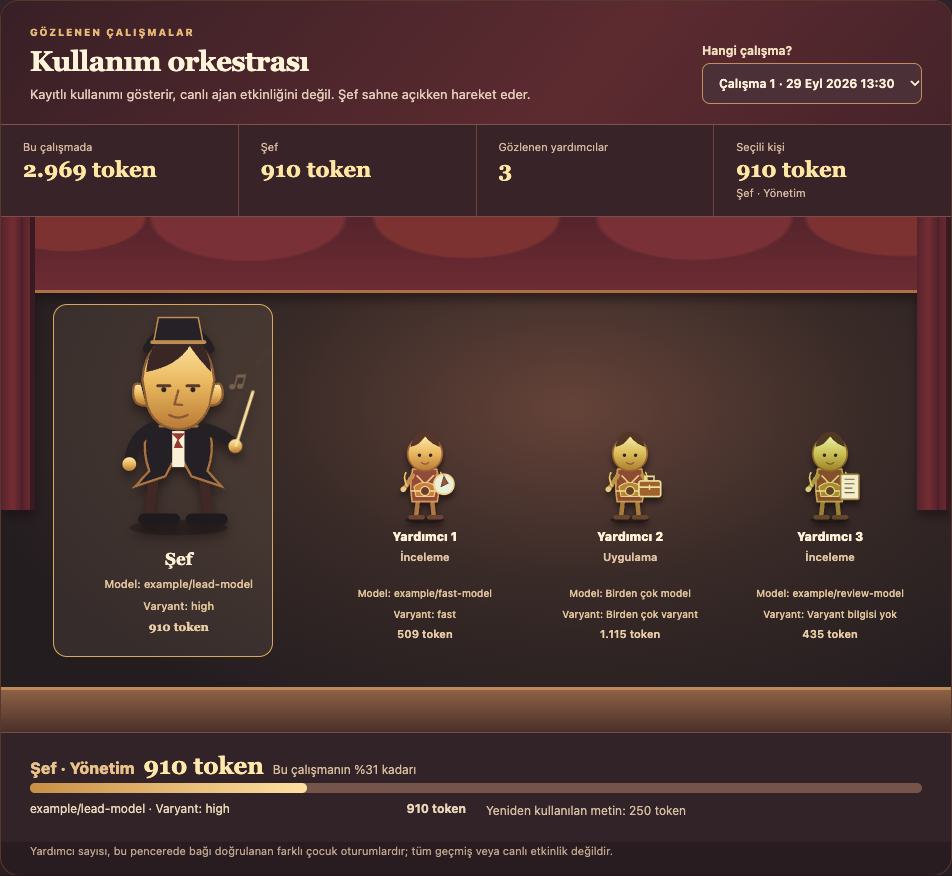
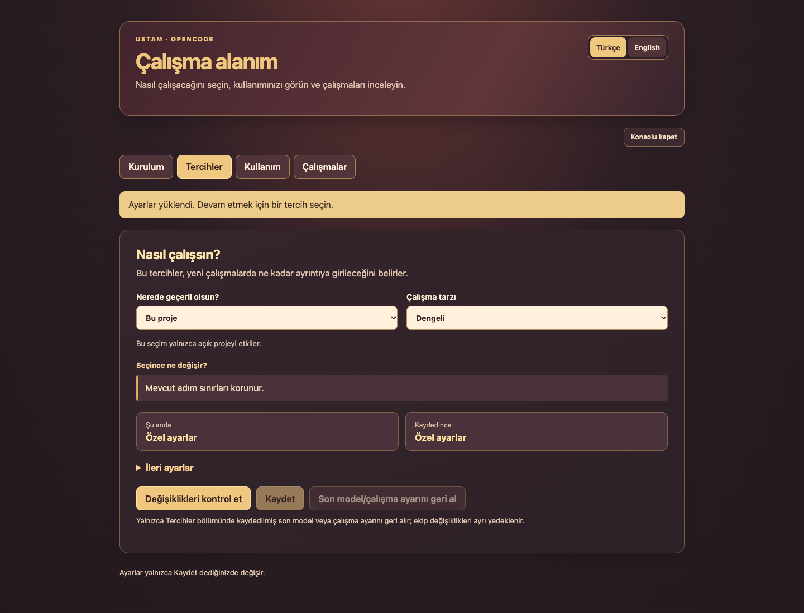
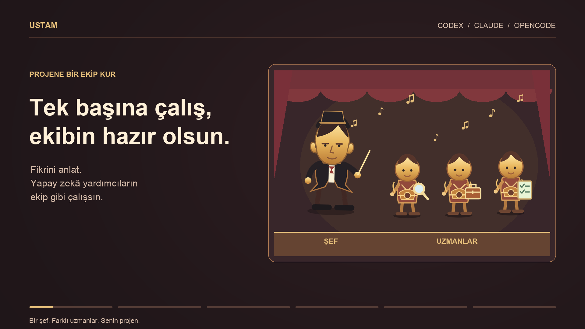

[English](README.md) · [Türkçe](README.tr.md)



# Ustam

[](https://github.com/metapak/ustam-opencode-orchestrator/actions/workflows/ci.yml)
[](LICENSE)

Sınırları belirlenmiş bir **OpenCode V2** ekibi için yerel, Türkçe/İngilizce kurulum ve kullanım ekranı. Siz sonucu tarif edersiniz; ana şef işi planlayıp sınırları belirli görevlere ayırır ve yardımcılara devreder. Şef kaynak araştırması, düzenleme, derleme, test veya inceleme işini kendi yapmaz.

> Resmî olmayan topluluk projesidir; OpenCode veya geliştiricileriyle bağlantılı ya da onlar tarafından onaylanmış değildir.

## Dört adımda kurulum

Önce OpenCode V2 2.0.0+ ve [Python 3.11 veya yenisi](https://www.python.org/downloads/) kurulu olsun. Python bu indirmeye **dahil değildir**.

1. **İndirin:** [Güncel ZIP dosyasını alın](https://github.com/metapak/ustam-opencode-orchestrator/archive/refs/heads/main.zip) ve açılan klasöre girin.
2. **Açın:** Mac'te `launchers` klasöründeki **Ustam.app** dosyasına çift tıklayın. Windows'ta aynı klasördeki **Launch Ustam.vbs** dosyasına çift tıklayın. Linux'ta aşağıdaki kısa komutu kullanın.
3. **Proje seçin:** Mac veya Windows'ta OpenCode kullandığınız klasörü seçin. Linux'ta bu klasörü komutta belirtirsiniz.
4. **Kurun:** Tarayıcıda önerilen ekibi bırakabilir veya değiştirebilirsiniz. **Kurulumu kontrol et** düğmesine basın, dosya listesini inceleyip **Kur ve kaydet** ile onaylayın. OpenCode'u bu projede yeniden başlatın.

Mac uygulamasını açılan klasörün içinde tutun. macOS kurulum paketini sorarsa ilk pencere, adı `ustam-opencode-orchestrator` ile başlayan ZIP dosyasından çıkan dış klasörü anlatır. Kısa başlıklı seçici İndirilenler’de açılır; bu klasörde `launchers` ve `scripts` bulunur. Yanlış seçimde **Yeniden dene** ile tekrar seçebilirsiniz. İkinci pencerede OpenCode kullandığınız ayrı Git projesini seçin; ayarlar oraya yazılır ve kurulum tarayıcıda devam eder. Pencereler birincil sistem diliniz Türkçe ise Türkçe, diğer durumlarda İngilizce gösterilir. Tarayıcı açılamazsa başlatıcı, elle açabileceğiniz tam yerel adresi gösterir.

<details>
<summary>Linux: aynı kurulum ekranını açın</summary>

Bu pakette Linux için çift tıklamalı başlatıcı veya klasör seçici yoktur. Açtığınız klasörde terminal açın ve projenizin yoluyla şu komutu çalıştırın:

```bash
python3 scripts/dashboard.py /projenizin/tam/yolu
```

</details>

Ekibi daha sonra değiştirmek için başlatıcıyı yeniden açıp (Linux'ta komutu yineleyip) yeni seçimleri **Kaydet** ile uygulayın. Ayarlar projeye hemen yazılır; silip yeniden kurmanız gerekmez. Açık OpenCode oturumunun yeni ayarları kullanması için oturumu yeniden açmanız gerekebilir. Kurulum açılmazsa [Mac/Linux](INSTALL-MACOS-LINUX.md) veya [Windows](INSTALL-WINDOWS.md) rehberine bakın.

## Ekip nasıl çalışır?



Kurulan ana `owner` için varsayılan araç izni kapalıdır; yalnızca bounded-orchestrator becerisi, kullanıcıya soru sorma ve seçilen yardımcı ajanlara devir açıktır. Talimatları onu konuşma, planlama, devir ve kısa uzman raporlarıyla sınırlar. Yardımcılar yeni yardımcı açamaz; yalnızca `implementer` temelli bir yardımcı, kendisine verilen alanda uygulama yazar. Varsayılan bir uygun yardımcıdır; eşzamanlı iş için bağımsız alanlar ve gerekçe gerekir. Bunlar OpenCode ayarı ve talimatlarıdır; paket dış çalışma zamanının her davranışını denetlediğini iddia etmez.

Tarayıcıdaki Kurulum *planlanan* ekibi, Kullanım ise *gözlenen* oturumları gösterir. Örnek orkestradaki dört karakter, dört ajan sınırı veya şu an çalışan dört ajan demek değildir. OpenCode'un temizlenmiş dışa aktarımı kararlı oturum bağları içeriyorsa şef ve bağlı çocuk oturumlardaki yardımcılar gösterilir. Gözlenen her karakterin görevine özel çizimi ve görünür model/varyant bilgisi vardır; eksik değerler açıkça belirtilir. Tek başına model veya rol, ajan kimliği sayılmaz. Şefe tıklayınca baton ve notalar başlar; başka yere tıklayana kadar döner. Enter ve Space de düğmeyi etkinleştirir. Otomatik hareket veya ayrı Canlandır düğmesi yoktur.

Kullanım grafikleri en son 12 temizlenmiş oturumun kesin gözlenen sayaçlarını temel alır; bilinmeyen ve eksik kapsam gösterilir. `opencode stats` ekran sayıları yuvarlanmış olabilir ve kesin grafiklere sessizce eklenmez. Çalışma tarzı dağılımı yalnızca oturum yerel ayar geçmişiyle güvenle eşleştiğinde tahmin edilir. Maliyet, kota, tasarruf, abonelik bakiyesi veya canlı ajan çalışması çıkarılmaz. DEMO verileri hesap kullanımı gibi sunulmaz. Bkz. [kullanım ve yerel kontrol](docs/usage-and-local-eval.tr.md).

## Kayıtlı kullanımı görün



*Güncel yerel konsoldan temizlenmiş demo verileriyle alınmıştır. Oturumlar, modeller, varyantlar ve token sayıları örnektir; kayıtlı kullanım gösterilir, canlı etkinlik değildir.*

## Tercihler ve güvenli değişiklik



*Geçici demo projede güncel yerel arayüz. Model erişimi projeye ve yapılandırılmış sağlayıcıya bağlıdır.*

Çalışma tarzları sınırlı OpenCode `steps` bütçelerini değiştirir; bunlar token tavanı değildir. Ekonomi ve Kota tasarrufu daha az adım ayırıp erken durabilir; Kalite daha çok adım ayırır. Kesin token tasarrufu vaat etmez veya düşünme eforunu kendiliğinden değiştirmez. Model listesi, varsa seçilen projenin `opencode models` sonucundan gelir; çevrimdışı örnekler doğrulanmamış olarak işaretlenir. **Model listesini yenile** yalnızca tıklandığında OpenCode'dan yenileme ister. Konsol kimlik bilgilerini veya sohbet gövdelerini göstermez.

Kurulum değişiklikleri önce gösterilir, ardından seçilen projeye sahiplik kaydı ve özel yedeklerle yazılır. Ekip küçültülürken yalnızca daha önce yönetilen ve değişmemiş yardımcı dosyaları kaldırılır; kaldırılanlar yedeklenir. **Tercihler → Son değişikliği geri al**, yalnızca konsolun son tercih kaydını geri çevirir ve ilgisiz ayarları korur. Ekip kurulumunu veya küçültmeyi geri almaz. Dışarıda değiştirilmiş ya da çakışan yönetilen dosyalar sessizce ezilmez. Özel çalışma verileri Git tarafından yok sayılır; kaldırma ilgisiz ve değiştirilmiş dosyaları korur. Bkz. [profiller](docs/profiles.tr.md), [mimari](docs/architecture.md), [görev kaydı](docs/task-ledger.tr.md) ve [SSS](docs/faq.tr.md).

## Ustam tanıtımı

[](https://raw.githubusercontent.com/metapak/ustam-opencode-orchestrator/main/docs/assets/ustam-promo-tr-40s.mp4)

Ustam için 40 saniyelik Türkçe tanıtım. Görsel önizleme örnek veriler kullanır. [MP4 videoyu oynatın veya indirin](https://raw.githubusercontent.com/metapak/ustam-opencode-orchestrator/main/docs/assets/ustam-promo-tr-40s.mp4).

## Geliştirme ve sınırlar

Kurucu ve depo testleri GitHub Actions üzerinde Ubuntu, macOS ve Windows'ta çalışır. Bu geliştirme ortamında OpenCode CLI ve gerçek sağlayıcı oturumu yoktu; Finder/Windows üzerinden gerçek çift tıklama da denenmedi. Tarayıcı akışları temizlenmiş örnek verilerle kontrol edildi. Model erişimi, varyantlar ve canlı dışa aktarım biçimi kurulumunuza bağlıdır. Üretilen dosyalar belgelenen OpenCode V2 ayar ve izin sözleşmelerini kullanır; paket model erişimini veya sayısal eşzamanlı yardımcı sınırını garanti edemez.

[Yol haritası](docs/roadmap.tr.md), [katkı rehberi](CONTRIBUTING.md), [güvenlik politikası](SECURITY.md), [değişiklik geçmişi](CHANGELOG.md) ve [sürüm notları](docs/release-v0.1.0.tr.md) bulunur. Apache-2.0 lisanslıdır; atıf [NOTICE](NOTICE) ve [kaynak bilgileri](docs/provenance.md) dosyalarındadır.
