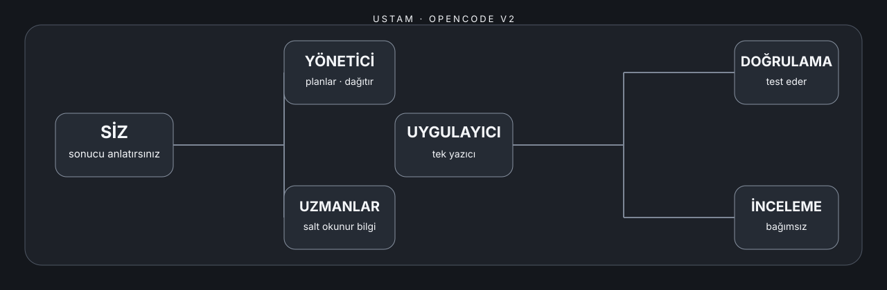

[English](README.md) · [Türkçe](README.tr.md)

# OpenCode Bounded Orchestrator

Sınırları belirlenmiş bir **OpenCode V2** ekibi için yerel, Türkçe/İngilizce kurulum ve kullanım ekranı. Siz sonucu tarif edersiniz; ana şef işi planlayıp sınırları belirli görevlere ayırır ve yardımcılara devreder. Şef kaynak araştırması, düzenleme, derleme, test veya inceleme işini kendi yapmaz.

> Resmî olmayan topluluk projesidir; OpenCode veya geliştiricileriyle bağlantılı ya da onlar tarafından onaylanmış değildir.

## Tarayıcıda başlayın

Uygun ZIP dosyasını tamamen çıkarın, ardından:

- **macOS:** `launchers/Bounded Orchestrator.app` dosyasını açıp mevcut bir proje klasörü seçin.
- **Windows:** `launchers/Launch Bounded Orchestrator.vbs` dosyasını açıp mevcut bir proje klasörü seçin.
- **Linux veya terminal:** Çıkardığınız pakette `python3 scripts/dashboard.py /proje/yolu` komutunu çalıştırın.

Başlatıcı için ayrıca **Python 3.11+** kurulmalıdır; Python paketlenmez. Proje klasörünün Git deposu olması şart değildir, ancak depo çalışmaları için Git yararlıdır. Kurulan ajanları kullanmak için OpenCode V2 2.0.0+ gerekir. Tarayıcı ekranı yalnızca `127.0.0.1` adresinde çalışır, varsayılan dili Türkçedir ve İngilizceye geçilebilir. Seçilen proje yolu ekranda salt okunurdur. Başka proje için başlatıcıyı yeniden açıp o klasörü seçin.

**Kurulum** bölümünde 1–10 hazır yardımcı yuvası, her yardımcı için görev ve model, ayrıca çalışma tarzı seçin. Aynı görevi iki yuvaya verebilirsiniz; bunlar ayrı adlandırılmış OpenCode ajanlarıdır. **Kur ve kaydet** öncesinde dosya değişikliklerini gözden geçirin; sonra OpenCode'u projede yeniden başlatın. Yuva sayısı kapasitedir; otomatik başlatma sayısı veya garantili sayısal eşzamanlılık sınırı değildir. Modellerin kullanılabilirliği OpenCode kurulumunuza ve sağlayıcı erişiminize bağlıdır. Doğrulanmış varyant/efor listesi yoksa yeni seçim kapalıdır; mevcut özel seçim korunur.

Eski `setup.command` / `setup.cmd` ve `scripts/install.py` terminal kurucuları da kullanılabilir. Ayrıntılar: [macOS/Linux kurulum](INSTALL-MACOS-LINUX.md), [Windows kurulum](INSTALL-WINDOWS.md), [yerel konsol](docs/local-console.md).

## Ekip nasıl çalışır?

Kurulan ana `owner` için varsayılan araç izni kapalıdır; yalnızca bounded-orchestrator becerisi, kullanıcıya soru sorma ve seçilen yardımcı ajanlara devir açıktır. Talimatları onu konuşma, planlama, devir ve kısa uzman raporlarıyla sınırlar. Yardımcılar yeni yardımcı açamaz; yalnızca `implementer` temelli bir yardımcı, kendisine verilen alanda uygulama yazar. Varsayılan bir uygun yardımcıdır; eşzamanlı iş için bağımsız alanlar ve gerekçe gerekir. Bunlar OpenCode ayarı ve talimatlarıdır; paket dış çalışma zamanının her davranışını denetlediğini iddia etmez.

Tarayıcıdaki Kurulum *planlanan* ekibi, Kullanım ise *gözlenen* oturumları gösterir. Örnek orkestradaki dört karakter, dört ajan sınırı veya şu an çalışan dört ajan demek değildir. OpenCode'un temizlenmiş dışa aktarımı kararlı oturum bağları içeriyorsa şef ve bağlı çocuk oturumlardaki yardımcılar gösterilir. Gözlenen her karakterin görevine özel çizimi ve görünür model/varyant bilgisi vardır; eksik değerler açıkça belirtilir. Tek başına model veya rol, ajan kimliği sayılmaz. Şefe tıklayınca baton ve notalar başlar; başka yere tıklayana kadar döner. Enter ve Space de düğmeyi etkinleştirir. Otomatik hareket veya ayrı Canlandır düğmesi yoktur.

Kullanım grafikleri en son 12 temizlenmiş oturumun kesin gözlenen sayaçlarını temel alır; bilinmeyen ve eksik kapsam gösterilir. `opencode stats` ekran sayıları yuvarlanmış olabilir ve kesin grafiklere sessizce eklenmez. Çalışma tarzı dağılımı yalnızca oturum yerel ayar geçmişiyle güvenle eşleştiğinde tahmin edilir. Maliyet, kota, tasarruf, abonelik bakiyesi veya canlı ajan çalışması çıkarılmaz. DEMO verileri hesap kullanımı gibi sunulmaz. Bkz. [kullanım ve yerel kontrol](docs/usage-and-local-eval.tr.md).

## Tercihler ve güvenli değişiklik

Çalışma tarzları sınırlı OpenCode `steps` bütçelerini değiştirir; bunlar token tavanı değildir. Ekonomi ve Kota tasarrufu daha az adım ayırıp erken durabilir; Kalite daha çok adım ayırır. Kesin token tasarrufu vaat etmez veya düşünme eforunu kendiliğinden değiştirmez. Model listesi, varsa seçilen projenin `opencode models` sonucundan gelir; çevrimdışı örnekler doğrulanmamış olarak işaretlenir. **Model listesini yenile** yalnızca tıklandığında OpenCode'dan yenileme ister. Konsol kimlik bilgilerini veya sohbet gövdelerini göstermez.

Kurulum değişiklikleri önce gösterilir, ardından seçilen projeye sahiplik kaydı ve özel yedeklerle yazılır. Ekip küçültülürken yalnızca daha önce yönetilen ve değişmemiş yardımcı dosyaları kaldırılır; kaldırılanlar yedeklenir. **Tercihler → Son değişikliği geri al**, yalnızca konsolun son tercih kaydını geri çevirir ve ilgisiz ayarları korur. Ekip kurulumunu veya küçültmeyi geri almaz. Dışarıda değiştirilmiş ya da çakışan yönetilen dosyalar sessizce ezilmez. Özel çalışma verileri Git tarafından yok sayılır; kaldırma ilgisiz ve değiştirilmiş dosyaları korur. Bkz. [profiller](docs/profiles.tr.md), [mimari](docs/architecture.md), [görev kaydı](docs/task-ledger.tr.md) ve [SSS](docs/faq.tr.md).

## Geliştirme ve sınırlar

Kurucu ve depo testleri GitHub Actions üzerinde Ubuntu, macOS ve Windows'ta çalışır. Bu geliştirme ortamında OpenCode CLI ve gerçek sağlayıcı oturumu yoktu; Finder/Windows üzerinden gerçek çift tıklama da denenmedi. Tarayıcı akışları temizlenmiş örnek verilerle kontrol edildi. Model erişimi, varyantlar ve canlı dışa aktarım biçimi kurulumunuza bağlıdır. Üretilen dosyalar belgelenen OpenCode V2 ayar ve izin sözleşmelerini kullanır; paket model erişimini veya sayısal eşzamanlı yardımcı sınırını garanti edemez.

[Yol haritası](docs/roadmap.tr.md), [katkı rehberi](CONTRIBUTING.md), [güvenlik politikası](SECURITY.md), [değişiklik geçmişi](CHANGELOG.md) ve [sürüm notları](docs/release-v0.1.0.tr.md) bulunur. Apache-2.0 lisanslıdır; atıf [NOTICE](NOTICE) ve [kaynak bilgileri](docs/provenance.md) dosyalarındadır.
